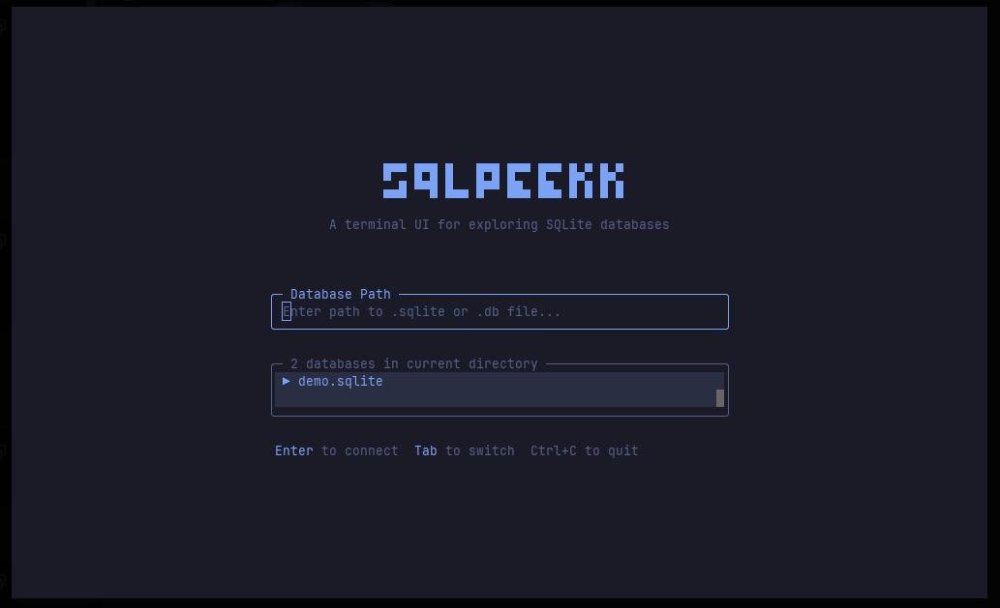

# sqlpeek

sqlite tui. open db, run queries, look at stuff.



## install

```bash
bun install
```

## run

```bash
bun dev your.db
```

or just `bun dev` and type the path in the ui

## keys

| key                 | does                |
| ------------------- | ------------------- |
| `Tab`               | switch panels       |
| `F5` / `Ctrl+Enter` | run query           |
| `Enter`             | browse table        |
| `i`                 | table schema        |
| `r`                 | refresh tables      |
| `< >`               | move sort column    |
| `s`                 | flip sort direction |
| `e`                 | export csv          |
| `?`                 | help                |
| `Ctrl+D`            | disconnect          |
| `Ctrl+C`            | quit                |

## features

- browse tables
- write sql and run it
- sort results
- export to csv
- schema viewer
- query history (up arrow)
- null values highlighted differently
- mouse clicks work

## stack

- [bun](https://bun.sh) — runtime
- [opentui](https://github.com/anomalyco/opentui) — tui framework
- `bun:sqlite` — built-in, no extra deps
